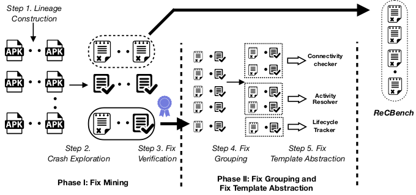

## CraftDroid and ReCBench
### CraftDroid
CraftDroid is an approach for minging crash-inducing bug fixes in Android apps. As depicted in the Figuire below.
              
### ReCBench
ReCBench is a collection of 200 Android crashed apps (where you must download from [AndroZoo](https://androzoo.uni.lu) with the sha256 provided for each apk) with crash reproducing script and crash message filtered out from LogCat.
The dataset is accessible [here](https://github.com/CraftDroid/ReCBench).

### Experimental Data
#### Fix Templates
We have mined 17 fix templates that are accessible [here](https://github.com/CraftDroid/ExpData/tree/master/Fix_Templates).
#### Evaluated Patches
We have applied these fix templates on 20 apks selected from ReCBench, out of which 17 fixes are successful. 3 failed for various reasons. Click on the app names for a diff view of the patches. 

(Actively updating diff view on 21-03-2019, may I have your patience, please ^_^)

App Name |Bucket| Applied Template | Fix | Remark|
|-------|------|---------|------|------|
[AutoHome](https://github.com/CraftDroid/ExpData/commit/cca641e121720856e659879ef8b4675ed6f8356f) | 8 |LifeCycle Verifier | yes |   |
PI | 8| LifeCycle Verifier | yes | |
JadwalKA |12| Thread Finisher | yes | |
Fruit Mahjong |12| Thread Finisher | yes | |
[Flashlight](https://github.com/CraftDroid/ExpData/commit/cc549ab14ad3499270a922819a09226405a9abd3) | 1 | Provider Checker | yes | | 
[areain!](https://github.com/CraftDroid/ExpData/commit/3f18d8b980d7b2b3bd6a7a7cee6044569361e665) | 1 |Provider Checker | yes | |
 WordPress |18| Range Checker | no | crash with succeeding API |
[Android Optimizer](https://github.com/CraftDroid/ExpData/commit/8ee947a913fc1397c6756b7d4eac917fd49593c7) |18| Range Checker | yes | |
[Mine\_mine](https://github.com/CraftDroid/ExpData/commit/dbdb8db7c9a4cb67ba7dd33beb1b61fd58539fa2) |20| Emptiness Checker | yes | |
[SetCPU](https://github.com/CraftDroid/ExpData/commit/e9664d29d2038b5c58279d333a54b80909e3e5be) |20| Emptiness Checker | no | String null throw NPE|
FingerWQ | 23|Canvas Preconcator | no | app method non existing |
[BTCfx](https://github.com/CraftDroid/ExpData/commit/ca263e4f33077074f2801ae3b97cff673695381d) |15| Package Settler | yes | |
 MapCam | 15|Package Settler | yes | |
 [Baby Piano](https://github.com/CraftDroid/ExpData/commit/a63c31e2ce703dd5dfc74d1c4ddb175b5b4d26ee) |2| Activity Resolver | yes | |
 [GK in Gujarati](https://github.com/CraftDroid/ExpData/commit/5162b8febfaea0c8c7c03a9b6d9371919ec4698a) |2| Activity Resolver | yes | |
 Reflection | 2|Activity Resolver | yes | |
 [UK Lotto](https://github.com/CraftDroid/ExpData/commit/67ab10253b8dfdf0d52861a85358cded730e5d2b) | 2|Activity Resolver | yes | |
 Agile Buddy | 2|Activity Resolver | yes | |
 [HiYou Park](https://github.com/CraftDroid/ExpData/commit/189292caa667d5938b40601fba355545cd6133f1) | 33|Try-catcher | yes | |
 [Sohu Weibo](https://github.com/CraftDroid/ExpData/commit/48b2e034fe2222b612ea5cb60d6e4c38ed542054) | 33|Try-catcher | yes | |

